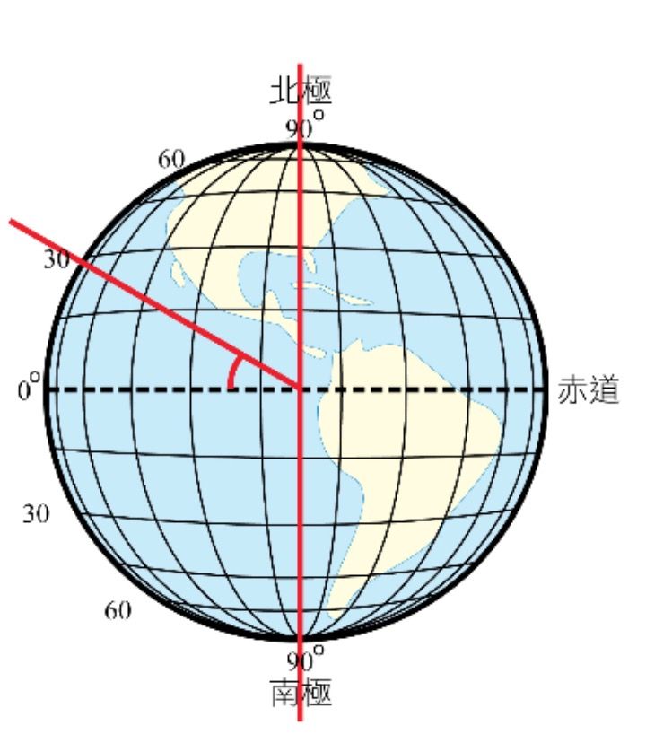
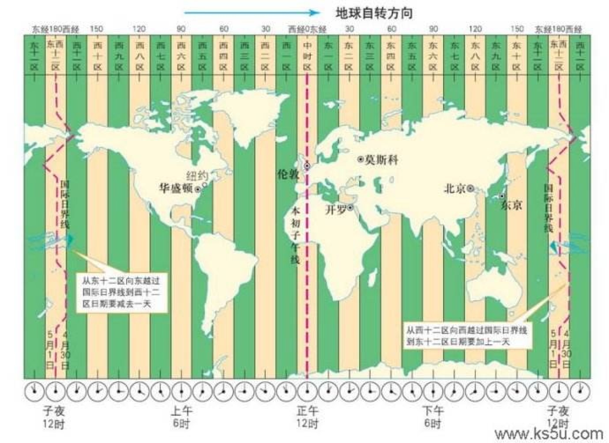

# The date-line and the poles
今天看postgis文档时，说到所有球形形状的计算都不涉及date-line和poles的概念。那么date-line和poles到底是什么，有什么影响？

先说poles，比较简单，也就是地理极点。对于地球来说就是南极点与北极点。南北极点是唯一的，也比较好确认，也就是行星、卫星或其它较大天体的自转轴与其表面交会的点。

确定了南北极点，那么纬线也就确认了，0纬线也就是赤道线，与自转轴垂直，往南就是南纬，往北就是北纬，由于赤道与自转轴是垂直关系，所以角度最大是90度，即南纬最大90度，北纬最大90度。看图：

确定了纬线，那么就可以找经线了，经线与纬线是垂直的。也就是，纬线瓜分南北半球，经线瓜分东西半球。那么问题来了，0经线是哪里？在地球上每个国家都把太阳升起的时间当作一天的开始，地球被太阳光照射的半个球面形成白昼，而背着太阳光的另外半个球面便是黑夜。但是由于各国家分布在地球各个地方，加上自转，所以见到太阳的时间是不一样的。讲道理的话，任何一条经线都可以称为0经线，但是这样的话，全球时间就不能统一了。所以后来规定了本初子午线（子午线即经线）作为0经线，它经过了格林威治天文台，本初子午线的对面即180经线就是国际日界线，即国际日期变更线（经过这条线后日期要变），当然为了避免同一国家出现2个日期，所以这条线不是直线，而是绕过一些岛屿啥的，是经过了太平洋的一条折线。

概念都清楚了，那么这些线对地球人有什么影响呢？最大的影响就是日期与时间的统一。

“区时系统”规定，地球上每15°经度范围作为一个时区（即太阳1个小时内走过的经度）。 这样，整个地球的表面就被划分为24个时区。各时区的“中央经线”规定为0°（即“本初子午线”）、东西经15°、东西经30°、东西经45°……直到180°经线，在每条中央经线东西两侧各7.5°范围内的所有地点，每一时区都按它的中央子午线来计量时间，即采用它的中央子午线的地方平时，叫做标准时。所以地球上只有24种不同时刻的存在。本初子午线上的地方如果是下午12点，那么在地球背面的地方就是子夜12点。

有了时区系统，问题又来了，假如你坐飞机从西往东越过了日界线，每跨越一个时区，就会把你的表向前拨一个小时加上你旅行消耗的时间，这样当你跨越24个时区回到原地后，你的表比身边的人快了24个小时；相反，当你由东向西周游世界一圈后，你的表就比别人慢24个小时。

当你在从东向西的航行中,因为你是在追赶太阳,所以就感到白天“加长”了；相反,当你从西向东航行时、由于是背离太阳、所以就好像有点白天“短”了的感觉.这样,你就往往会记错日子,把日历翻错.为了避免这种不方便,1884年起人们决定在太平洋中,也即在东经180度经线附近划一条线,规定当各种交通工具自东向西越过此线后,日期增加1天（例如,由7月31日改为8月1日〕,而由西向东越过此线后,日期减少1天（例如, 由8月1日日改为7月31）